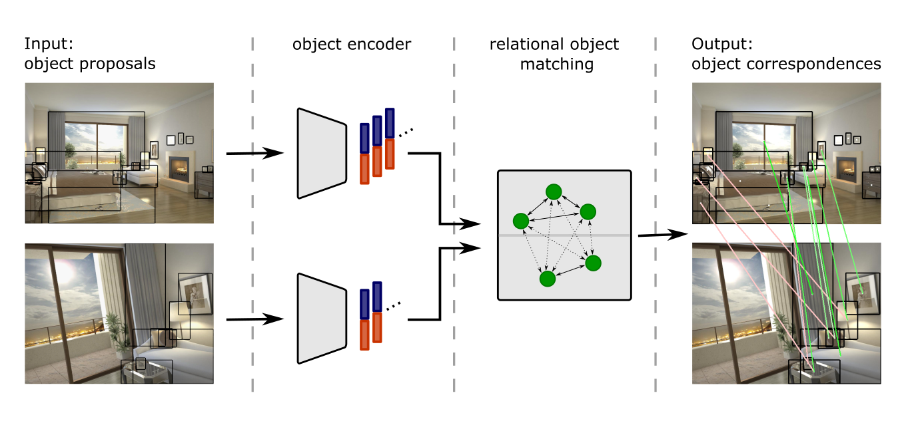

#  Learning-based Relational Object Matching Across Views




This repository provides source code for learning ROM-features accompanying the following publication:

*Cathrin Elich, Iro Armeni, Martin R. Oswald, Marc Pollefeys, and Joerg Stueckler, "**Learning-based Relational Object Matching Across Views**"*  
*Presented at the **IEEE International Conference on Robotics and Automation (ICRA)
2023***


If you use the source code provided in this repository for your research, please cite the corresponding publication as:
```
@inproceedings{elich2023_relobjmatch,
    title        = {Learning-based Relational Object Matching Across Views},
    author       = {Elich, Cathrin and Armeni, Iro and Oswald, Martin R. and Pollefeys, Marc and Stueckler, Joerg},
    year         = 2023,
    booktitle    = {IEEE International Conference on Robotics and Automation (ICRA)},
    doi          = {10.1109/ICRA48891.2023.10161393}
}
```

## Getting started

### Data

You can download the original Hypersim dataset [here](https://github.com/apple/ml-hypersim).

For training and evaluation, we pre-process relevant parts of the dataset:

```
python ./preprocessing/data_preparation/prepare_hypersim.py --data_dir <PATH_TO_HYPERSIM_DATA> --meta_data_dir <PATH_TO_HYPERSIM_METADATA>
```

Our test splits can be found in [this KEEPER repository](https://keeper.mpdl.mpg.de/d/1989e6c43e454b8ca9fa/).

### Preparation

When training (and evaluating) on gt object detections, we make use of visual features extracted using a pre-trained ResNet34 which can be computed in advance to speed up training:

```
python -m preprocessing.eval_vis-feats.py --data_dir <PATH_TO_PREPROCESSED_HYPERSIM_DATA> --viz_feat_name basic_ResNet34
```

For evaluating the combination of our ROM features and keypoint-based matches, preprocess pre-computed keypoint matches as follows:

1. Pre-compute keypoint-based matrix, e.g. using SuperGlue. For each image pair, this should yield a numpy array of size (2 [index of image], N_keypoints, 2[x-/y-coord.]). 
   Results should be stored as e.g. [PATH_TO_KEYPOINT_MATCH_RESULTS]/test/ai_001_010/matches_cam00-frame0000_cam00-frame0038.npy.
2. Pre-compute object-specific vote matrix w.r.t. keypoint matches by running
    ```
    python -m preprocessing.eval_vis-feats.py \
      --data_dir <PATH_TO_PREPROCESSED_HYPERSIM_DATA> \
      --keypoint_matching_res_dir <PATH_TO_KEYPOINT_MATCH_RESULTS> \
      --output_dir <PATH_TO_KEYPOINT_MATCH_RESULTS> 
      --split <from [train, val, test]> 
    ```
    Results will be stored e.g. as [PATH_TO_KEYPOINT_MATCH_RESULTS]/processed_results/test/ai_001_010/matches_cam00-frame0000_cam00-frame0010.npy.

For evaluating on detections, instead of gt bounding boxes, pre-compute detections as follows:

```
python -m preprocessing.eval_tf-detector --data_dir <PATH_TO_HYPERSIM_DATA>
```


## Running the experiments

### Training

For training from scratch, run
```
python ./rel_obj_match/eval_combi.py \
	--message std \
	--data_dir <PATH_TO_HYPERSIM_DATA> \
	--log_dir <OUTPUT_DIRECTORY> \
	--model romnet
```

### Evaluation

For evaluating on gt object bounding boxes:
```
python ./rel_obj_match/eval_combi.py \
  --message std \ 
  --data_dir <PATH_TO_HYPERSIM_DATA> \ 
  --log_dir <OUTPUT_DIRECTORY> \ 
  --lvl <LVL OF DIFFICULTY> \ 
  --model romnet
```

For evaluating on object detections:

```
python ./rel_obj_match/eval_combi_detections.py \
  --message std \
  --data_dir <PATH_TO_HYPERSIM_DATA> \
  --log_dir <OUTPUT_DIRECTORY> \
  --lvl <LVL OF DIFFICULTY> \
  --model romnet \
  --detector EfficientDet-D7
```

Our pre-trained model can be found in [this KEEPER repository](https://keeper.mpdl.mpg.de/d/1989e6c43e454b8ca9fa/).
Note that this model yields slightly different results for the auxilliary task compared to the scores reported in the paper (see [NOTES.md](NOTES.md)).

## License

See [LICENSE.md](LICENSE.md).

----------------------------------------------------------------------------------------------
